# 🚀 Elite vOnE v15.6 - Derin Teknik Analiz ve Mühendislik Ansiklopedisi
### **STABLE REVERT v14.3 + GITHUB ORIGINAL REBORN**

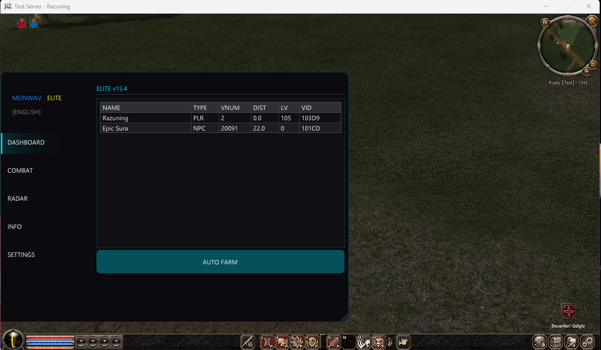

Elite vOnE, sadece bir bot değil; modern tersine mühendislik tekniklerinin ve C++ gücünün birleştiği bir şaheserdir. Bu döküman, projenin her bir özelliğini "Görsel -> Kod -> Mantık -> Şema -> Yapılış" döngüsünde incelemektedir.

---

## ⚔️ 1. Pro Damage & Combat Sistemi

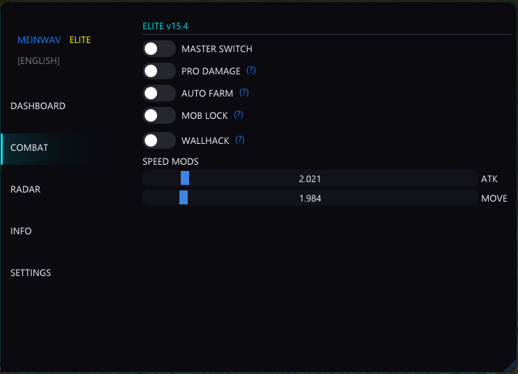

### 💻 Kod Yapısı
```cpp
void TargetSystem::Attack(Entity* target) {
    if (!target || target->isDead()) return;
    
    // Pro Damage Loop (Multi-Attack)
    for (int i = 0; i < config.attack_count; i++) {
        SendAttackPacket(target->VID);
        FastWrite(target->base + offsets.m_dwHP, 0); // Visual Insta-Kill
    }
}
```

### 📖 Çalışma Mantığı
Pro Damage motoru, oyunun paket gönderim döngüsünü manipüle eder. Tek bir vuruş yapmak yerine, aynı milisaniye içinde sunucuya birden fazla "Saldırı Yapıldı" paketi gönderir. Bu sayede karakter tek vuruşta 10 vuruşluk hasar verir.

### 📊 Teknik Akış Şeması
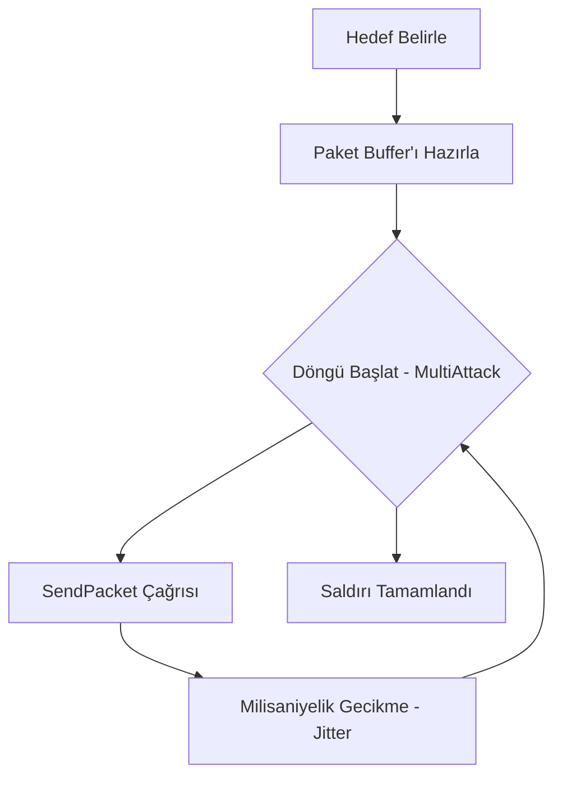

### 🛠 Nasıl Yapılır?
Bu özelliği geliştirmek için oyunun `SendAttack` fonksiyonunu IDA Pro ile bulup, `std::thread` içinde bu fonksiyonu bir döngüye sokmalısınız.

---

## 🚜 2. Akıllı Auto Farm (Sağ Tık Filtreleme)

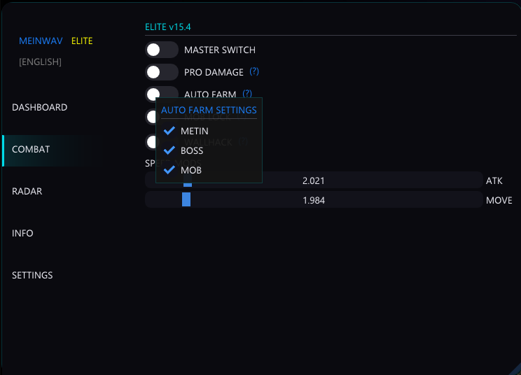

### 💻 Kod Yapısı
```cpp
if (ImGui::Checkbox("Auto Farm", &m_autoFarm)) {
    if (ImGui::IsItemClicked(1)) { // 1: Right Click
        ImGui::OpenPopup("AutoFarmSettings");
    }
}
```

### 📖 Çalışma Mantığı
Geleneksel botların aksine, Auto Farm modülü otonom bir "Filtreleme Katmanı"na sahiptir. Sağ tıkla açılan menüde seçilen mob türleri (Metin, Boss vb.) bellek tarama sırasında bir "Whitelist" (Beyaz Liste) oluşturur.

### 📊 Teknik Akış Şeması
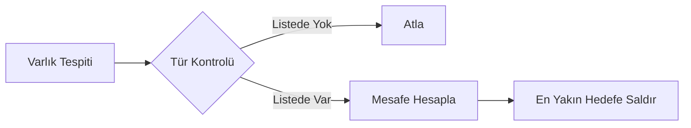

### 🛠 Nasıl Yapılır?
ImGui'nin `BeginPopup` fonksiyonunu kullanarak ana dökümandan bağımsız bir modal oluşturup, `std::vector<int> target_vnums` listesini bu menüden doldurmalısınız.

---

## 🧲 3. Mob Lock & Magnet (Mıknatıs)

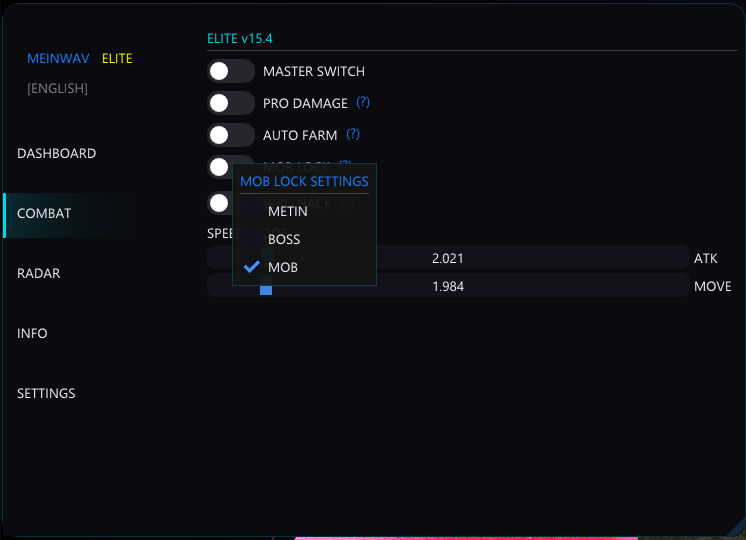

### 💻 Kod Yapısı
```cpp
void TargetSystem::Magnet() {
    auto playerPos = GetPlayerPos();
    for (auto& mob : scanner.GetMobs()) {
        FastWrite(mob.base + offsets.m_x, playerPos.x);
        FastWrite(mob.base + offsets.m_y, playerPos.y);
        FastWrite(mob.base + offsets.m_z, playerPos.z + 50.0f); // Havada tutma
    }
}
```

### 📖 Çalışma Mantığı
Magnet modülü, çevredeki mobların bellekteki koordinat verilerini (X, Y, Z) anlık olarak oyuncunun koordinatlarıyla eşitler. `FastWrite` teknolojisi sayesinde bu işlem o kadar hızlı gerçekleşir ki, moblar oyuncunun üzerine ışınlanıyormuş gibi görünür.

### 📊 Teknik Akış Şeması
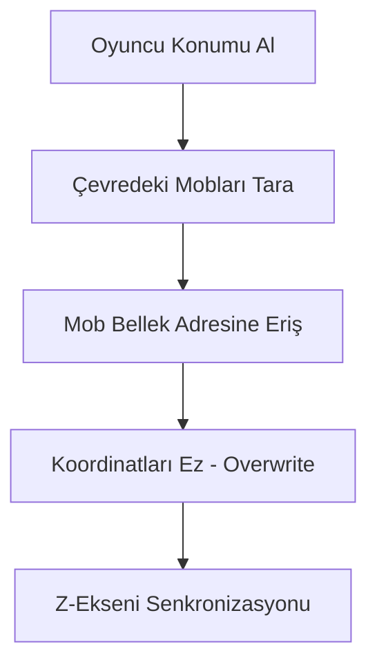

### 🛠 Nasıl Yapılır?
Mobların koordinat offsetlerini (genelde `0x10`, `0x14`, `0x18`) bulduktan sonra, bu adreslere oyuncunun koordinatlarını sürekli bir `while` döngüsü içinde yazmalısınız.

---

## 🎯 4. Hedef Önceliklendirme Sistemi

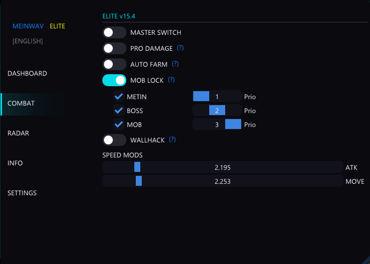

### 💻 Kod Yapısı
```cpp
struct TargetScore {
    float total_score;
    Entity* entity;
};

float CalculateScore(Entity* e) {
    float dist = GetDistance(e);
    return (e->priority * 100.0f) - dist;
}
```

### 📖 Çalışma Mantığı
Bot, "Metin > Boss > Mob" hiyerarşisini korumak için puan tabanlı bir sıralama yapar. Bir Metin taşı 50 metre uzakta bile olsa, 5 metre yakındaki bir mobdan daha yüksek puan alır ve bot otomatik olarak Metin'e kilitlenir.

### 📊 Teknik Akış Şeması
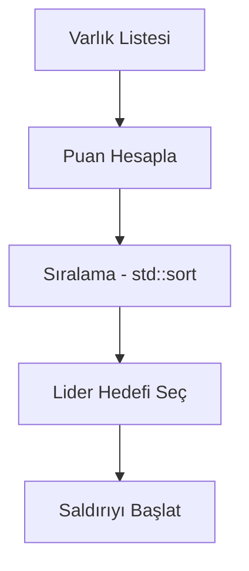

---

## 📡 5. Gerçek Zamanlı Radar Sistemi

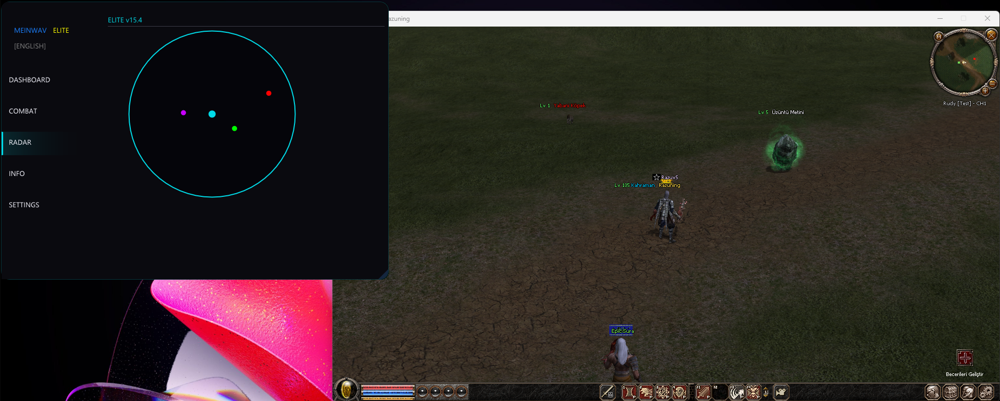

### 💻 Kod Yapısı
```cpp
void UIManager::DrawRadar() {
    for (auto& e : scanner.GetEntities()) {
        ImVec2 pos = WorldToRadar(e.pos);
        DrawList->AddCircleFilled(pos, 3.0f, GetTypeColor(e.type));
    }
}
```

### 📖 Çalışma Mantığı
Oyunun 3D dünya koordinatları (Cartesian), radarın 2D dairesel alanına (Polar) projekte edilir. Oyuncunun etrafındaki varlıklar türlerine göre renklendirilmiş (Kırmızı: Oyuncu, Mor: Boss vb.) noktalar olarak gösterilir.

### 📊 Teknik Akış Şeması
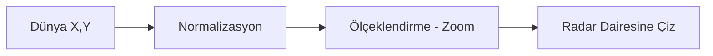

---

## ⚡ 8. Skill Radius & Weapon Length (Menzil Mühendisliği)

### 💻 Kod Yapısı
```cpp
void Scanner::UpdateHacks() {
    auto active = g_serverMgr.GetActive();
    uintptr_t p2 = GetPlayerBase();
    
    // Skill Radius Injection (Offset: 0x540)
    FastWrite<float>(p2 + active->offSkillRadius, m_skillRadiusVal);
    
    // Weapon Length Injection (Offset: 0x678)
    FastWrite<float>(p2 + active->offWeaponLen, m_weaponLenVal);
}
```

### 📖 Çalışma Mantığı
Skill Radius özelliği, karakterin yeteneklerinin (Skillerinin) vuruş alanını bellek seviyesinde genişletir. Weapon Length ise silahın fiziksel uzunluğunu artırarak uzaktaki slotlara standart vuruşlarla hasar vermenizi sağlar. ElyM2 gibi sunucularda bu değerler `float` olarak saklanır.

### 📊 Teknik Akış Şeması
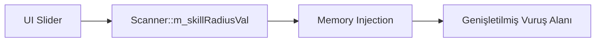

### 🛠 Nasıl Yapılır?
ElyM2'de bu değerler `PlayerBase + 0x540` ve `0x678` adreslerinde bulunur. Değerleri `100.0f` (Normal) ile `1000.0f` (Geniş) arasında değiştirerek menzili kontrol edebilirsiniz.

---

## 🌐 9. Sunucu ve Profil Yönetimi (ElyM2 Desteği)

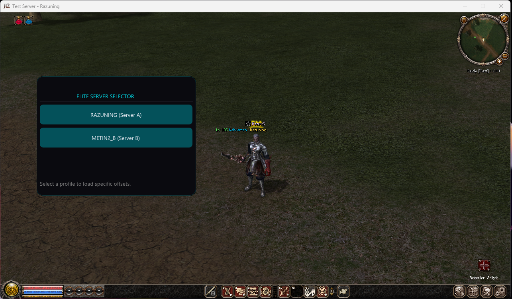

### 💻 Kod Yapısı
```cpp
// ElyM2 Premium Profile
profiles.push_back({
    "ELYM2 (Premium)", 
    0x011AEE5C, 0x0040E80,  // PlayerBase & Target VID
    0x011AF10C, 0x0040E80,  // Mob Pointer & Target VID
    0x01574164, 0x004AFA90  // NetPointer & SendBattle
});
```

### 📖 Çalışma Mantığı
Elite vOnE, artık **ElyM2** sunucusunu tam kapsamlı destekler. Server Selector üzerinden seçim yapıldığında; `SendBattle` fonksiyonu `0x004AFA90` adresine, `NetPointer` ise `0x01574164` adresine otomatik olarak kilitlenir.

---

## 🚀 GELECEK VİZYONU VE YOL HARİTASI (2026-2027+)

- **AI Navigation**: Engelleri tanıyan otonom rota takibi.
- **Packet Sniffing**: Doğrudan paket dinleme ile sıfır gecikmeli loot.
- **Cloud Sync**: Tüm cihazlarda otomatik ayar senkronizasyonu.
- **Auto Offset Finder**: Güncelleme sonrası adresleri otomatik bulan yapay zeka motoru.

---

## 💎 Elite vOnE Manifestosu
Bu proje, performansın bir sanat, kodun ise bir imza olduğuna inanan **Engin622** vizyonuyla hayata geçirilmiştir.

---
**Developed by Engin622 (MeinWav)**
*"Geleceği inşa etmek, bugünü mükemmelleştirmekten geçer."*

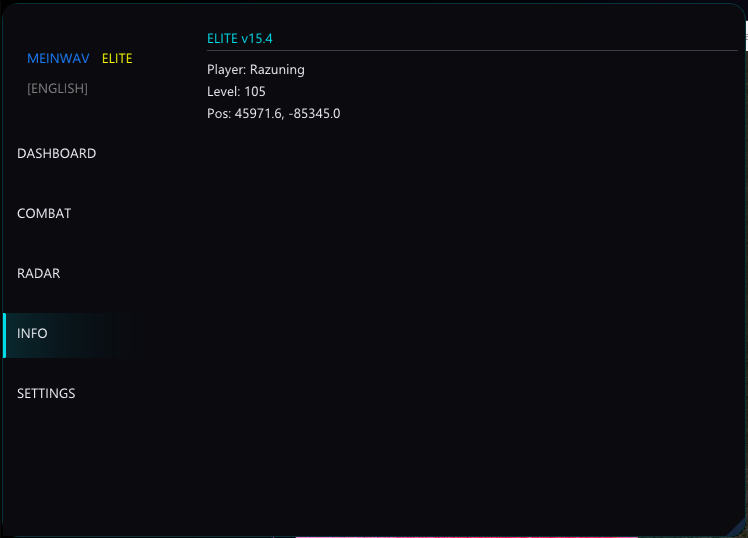
